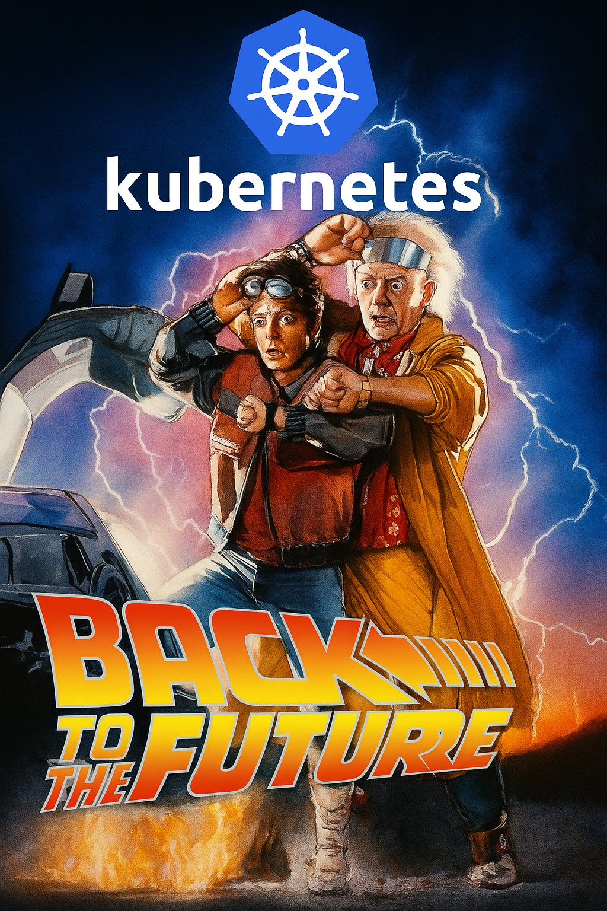
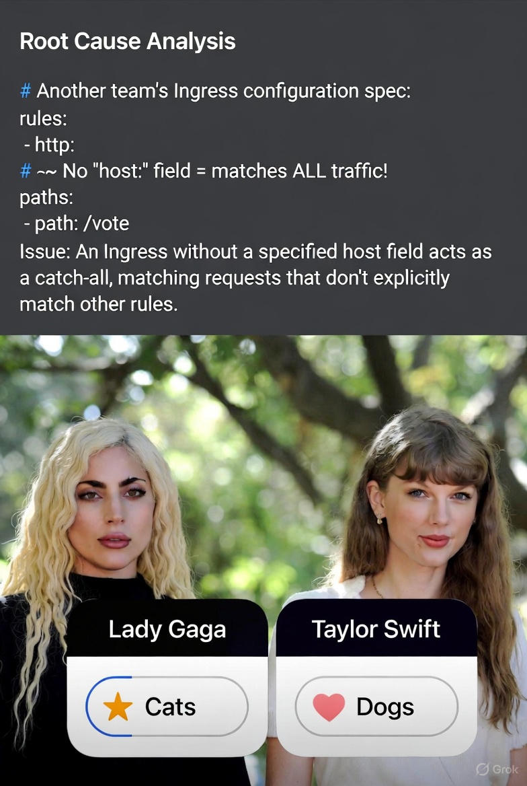

<!-- _class: dark -->

# Multistack App on Kubernetes

## Deploying a Voting Application to AWS EKS



<span class="badge">Python</span><span class="badge">Node.js</span><span class="badge">.NET</span><span class="badge">Redis</span><span class="badge">PostgreSQL</span>

---

## Project Overview

<div class="columns">
<div>

### The Challenge
- Multi-language microservices
- Real-time voting system
- Message queue processing
- Production-ready Kubernetes

</div>
<div>

### Tech Stack

**Vote:** Python/Flask
**Worker:** .NET 7
**Result:** Node.js/Express
**Queue:** Redis
**Database:** PostgreSQL

</div>
</div>

---

## Architecture

```
Browser (User)
   ↓
AWS ELB (Load Balancer)
   ↓
╔═══════════════════════════════════════╗
║   Kubernetes Cluster (EKS)            ║
║                                       ║
║  ┌─────────────────────────────────┐ ║
║  │ NGINX Ingress Controller Pod    │ ║
║  │ (Pre-installed infrastructure)  │ ║
║  └──────────┬──────────────┬───────┘ ║
║             │              │          ║
║  ┌──────────▼──┐   ┌───────▼──────┐ ║
║  │ Vote Pod    │   │ Result Pod   │ ║
║  │ (Flask)     │   │ (Node.js)    │ ║
║  └──────┬──────┘   └───────┬──────┘ ║
║         │ Writes            │ Reads  ║
║         ↓                   ↓        ║
║  ┌───────────┐       ┌────────────┐ ║
║  │ Redis Pod │       │Postgres Pod│ ║
║  └─────┬─────┘       └──────┬─────┘ ║
║        │ Consume            ↑        ║
║        ↓                    │        ║
║  ┌─────────────┐            │        ║
║  │ Worker Pod  │────────────┘        ║
║  │ (.NET)      │  Writes             ║
║  └─────────────┘                     ║
╚═══════════════════════════════════════╝
```

---

## CI/CD Pipeline

**Trigger:** Push to `main` branch

**Build Phase:**
- Build Docker images (vote, worker, result)
- Push to Docker Hub

**Deploy Phase:**
- Connect to EKS cluster
- Create Kubernetes secrets
- Apply manifests: `kubectl apply -f K8s/`

<span class="badge">Deployment: 7-10 min</span>

---

## Problem 1: Infrastructure Issues

**Symptoms:**
```
Browser: DNS_PROBE_FINISHED_NXDOMAIN
Worker:  Waiting for db... Giving up
```

**Root Causes:**

**Cluster Migration** `ironhack-main` → `ironhack-main-2`
- ELB changed, old DNS invalid

**Naming Chaos** - Code vs Kubernetes
- Code: `redis`, `db` | K8s: `marty-svc-redis`, `marty-svc-postgres`

**Missing Secrets** - Database credentials never created

---

## Solution 1: Infrastructure Fixes

<div class="columns">
<div>

**Networking**
<p class="check">Subdomain routing</p>
<p class="check">vote.marty.ironhack.com</p>
<p class="check">No path rewriting</p>

**Security**
<p class="check">GitHub Secrets → K8s</p>
<p class="check">Automated injection</p>

</div>
<div>

**Configuration**
<p class="check">Environment variables</p>
<p class="check">Service discovery</p>
<p class="check">Proper naming</p>

**Ingress**
<p class="check">ingressClassName: nginx</p>
<p class="check">Explicit hostnames</p>

</div>
</div>

---

<!-- _class: dark -->

# Problem 2

## The Wildcard Ingress Mystery



---

## Wildcard Ingress Issue

**What Happened?**

Accessing `vote.marty.ironhack.com` showed **Taylor Swift vs Lady Gaga** instead of **Cats vs Dogs**.

**Root Cause:**

```yaml
# Another team's Ingress
spec:
  rules:
  - http:  # No "host:" = catches ALL
      paths:
      - path: /vote
```

Ingress without `host` field acts as catch-all.

---

## Solution 2: Explicit Hosts

```yaml
apiVersion: networking.k8s.io/v1
kind: Ingress
metadata:
  name: marty-ingress
spec:
  ingressClassName: nginx
  rules:
  - host: vote.marty.ironhack.com
    http:
      paths:
      - path: /
        pathType: Prefix
        backend:
          service:
            name: marty-svc-vote
            port: {number: 80}
```

**Key Learning:** Always specify explicit `host` values

---

## Problem 3: Hardcoded Connections

<div class="columns">
<div>

**Vote (Flask)**
```python
# Before
Redis(host="redis")

# After
redis_host = os.getenv(
  'REDIS_HOST', 'redis'
)
Redis(host=redis_host)
```

</div>
<div>

**Result (Node.js)**
```javascript
// Before
'postgres://user:pass@db'

// After
`postgres://${process.env.POSTGRES_USER}:
${process.env.POSTGRES_PASSWORD}@
${process.env.POSTGRES_HOST}`
```

</div>
</div>

---

## Problem 3: Worker Variables

<div class="columns">
<div>

**Wrong Config**
```yaml
env:
  - name: POSTGRES_HOST
  - name: POSTGRES_USER
```

Code expected different names!

</div>
<div>

**Corrected**
```yaml
env:
  - name: DB_HOST
    value: "marty-svc-postgres"
  - name: DB_USERNAME
    valueFrom:
      secretKeyRef:
        name: marty-db-credentials
```

</div>
</div>

---

## Summary

**What We Accomplished:**

<p class="check">Multi-language microservices on Kubernetes</p>
<p class="check">AWS ELB + NGINX Ingress routing</p>
<p class="check">Secure secret management</p>
<p class="check">Automated CI/CD pipeline</p>

**Skills Demonstrated:**

**Kubernetes** - Deployments, Services, Ingress, Secrets
**AWS** - EKS, ELB
**Docker** - Multi-stage builds
**CI/CD** - GitHub Actions

---

<!-- _class: dark -->

# Questions?


---

<!-- _class: dark -->

# Thank You!

**Project Repository**
https://github.com/kaiser-data/marty-voting-app

**Live Application**
Vote: http://vote.marty.ironhack.com
Result: http://result.marty.ironhack.com

---
