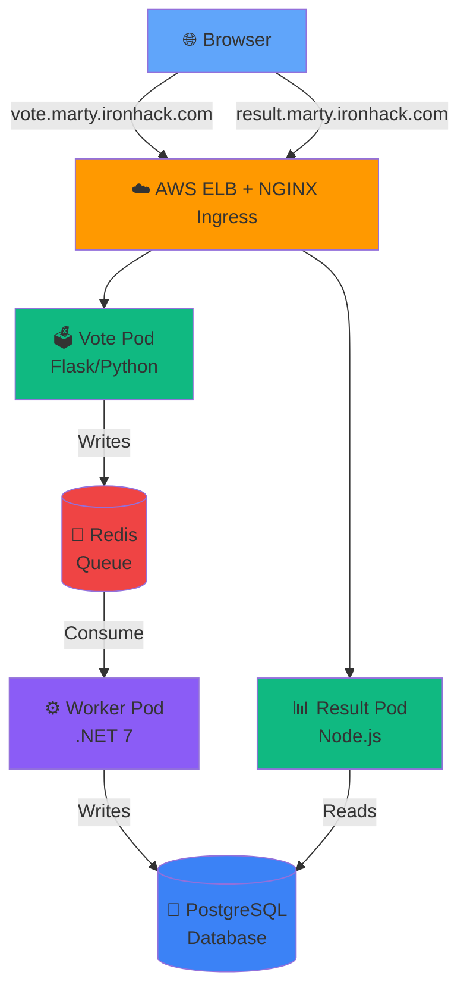

<!-- _class: lead -->

# 🚀 Multistack App on Kubernetes

## Deploying a Full-Stack Voting Application to AWS EKS


<div class="badge">Python</div> <div class="badge">Node.js</div> <div class="badge">.NET</div> <div class="badge">Redis</div> <div class="badge">PostgreSQL</div>

**Platform:** Kubernetes on AWS EKS

---

<!-- _class: content -->

## 📋 Project Overview

<div class="grid">
<div class="grid-item">

### 🎯 The Challenge
Deploy a **multi-language microservices application** to Kubernetes with:
- ⚡ Real-time voting system
- 🔄 Message queue processing
- 💾 Database persistence
- 🏗️ Production-ready infrastructure

</div>
<div class="grid-item">

### 🛠️ Tech Stack
- **Vote Service:** Python/Flask
- **Worker Service:** .NET 7
- **Result Service:** Node.js/Express
- **Queue:** Redis
- **Database:** PostgreSQL

</div>
</div>

---

<!-- _class: tech -->

## 🏗️ Architecture & Infrastructure



<div class="highlight">
<strong>Data Flow:</strong> Browser → Vote → Redis → Worker → PostgreSQL → Result → Browser
</div>

---

<!-- _class: tech -->

## 🔄 CI/CD Workflow

<div class="timeline">
<div class="timeline-item">

**1️⃣ Trigger**
Push to `main`

</div>
<div class="timeline-item">

**2️⃣ Build**
Docker images
→ Docker Hub

</div>
<div class="timeline-item">

**3️⃣ Deploy**
AWS + EKS
K8s Secrets

</div>
<div class="timeline-item">

**4️⃣ Result**
Production!
✅

</div>
</div>

### Pipeline Details

```yaml
GitHub Actions → Docker Build → Push to Registry
                    ↓
              Configure AWS Credentials
                    ↓
              Connect to EKS (ironhack-main-2)
                    ↓
              Create K8s Secrets from GitHub Secrets
                    ↓
              kubectl apply -f K8s/
```

<div class="badge">⏱️ Deployment Time: 7-10 minutes</div>

---

<!-- _class: problem -->

## Problem 1: Infrastructure & Configuration Hell

### 🚨 Multiple Issues Stacking Up

```bash
Browser: "DNS_PROBE_FINISHED_NXDOMAIN"
Worker:  "Waiting for db... Giving up"
```

### 🔍 Root Causes

<div class="grid">
<div class="grid-item">

**1. Cluster Migration**
`ironhack-main` → `ironhack-main-2`
- ELB changed
- Old DNS entries invalid

**2. Naming Chaos**
- Code: `redis`, `db`, `postgres`
- K8s: `marty-svc-redis`, `marty-svc-postgres`

</div>
<div class="grid-item">

**3. Missing Secrets**
`marty-db-credentials` never created

**4. Path Routing Issues**
- Apps expect `/`
- Ingress sent `/vote`, `/result`

</div>
</div>

---

<!-- _class: solution -->

## Solutions Applied

<div class="grid">
<div class="grid-item">

### 🌐 Networking
✅ Subdomain routing
✅ `vote.marty.ironhack.com`
✅ No path rewriting needed
✅ Modern Ingress config

</div>
<div class="grid-item">

### 🔐 Security
✅ GitHub Secrets → K8s Secrets
✅ Automated injection
✅ No hardcoded credentials
✅ CI/CD automation

</div>
</div>

<div class="grid">
<div class="grid-item">

### ⚙️ Configuration
✅ Environment variables
✅ 12-factor methodology
✅ Service discovery
✅ `marty-svc-*` naming

</div>
<div class="grid-item">

### 🏷️ Ingress Modernization
✅ `ingressClassName: nginx`
✅ Explicit hostname matching
✅ Conflict prevention
✅ Production-ready

</div>
</div>

---

<!-- _class: lead -->

# 🎤 Problem 2: The Wildcard Ingress Mystery

### Unexpected Traffic Routing


---

<!-- _class: problem -->

## The Wildcard Ingress Challenge

### 🤔 What Happened?

Accessing `vote.marty.ironhack.com` unexpectedly displayed a different voting application **(Taylor Swift vs Lady Gaga)** instead of the intended **Cats vs Dogs** interface.

### 🔬 Root Cause Analysis

```yaml
# Another team's Ingress configuration
spec:
  rules:
  - http:  # ⚠️ No "host:" field = matches ALL traffic!
      paths:
      - path: /vote
```

<div class="highlight">
<strong>💡 Issue:</strong> An Ingress without a specified <code>host</code> field acts as a catch-all, matching requests that don't explicitly match other rules.
</div>

---

<!-- _class: solution -->

## The Solution

### ✅ Explicit Hostname Matching

```yaml
# Updated Ingress - Specific routing
apiVersion: networking.k8s.io/v1
kind: Ingress
metadata:
  name: marty-ingress
  namespace: marty
spec:
  ingressClassName: nginx  # Modern approach
  rules:
  - host: vote.marty.ironhack.com      # ✅ Explicit
    http:
      paths:
      - path: /
        pathType: Prefix
        backend:
          service:
            name: marty-svc-vote
            port:
              number: 80
  - host: result.marty.ironhack.com    # ✅ Prevents conflicts
    http:
      paths:
      - path: /
        pathType: Prefix
        backend:
          service:
            name: marty-svc-result
            port:
              number: 80
```

---

<!-- _class: problem -->

## Problem 3: Hardcoded Connections Everywhere

<div class="grid">
<div class="grid-item">

### 🐍 Vote App (Flask)

```python
# ❌ Before
Redis(host="redis")

# ✅ After
redis_host = os.getenv(
    'REDIS_HOST',
    'redis'
)
Redis(host=redis_host)
```

</div>
<div class="grid-item">

### 🟢 Result App (Node.js)

```javascript
// ❌ Before
connectionString:
  'postgres://postgres:postgres@db/postgres'

// ✅ After
connectionString:
  `postgres://${process.env.POSTGRES_USER}:
   ${process.env.POSTGRES_PASSWORD}@
   ${process.env.POSTGRES_HOST}/
   ${process.env.POSTGRES_DB}`
```

</div>
</div>

---

<!-- _class: problem -->

## Problem 3: Worker Environment Variables

### 🔵 Worker App (.NET)

<div class="grid">
<div class="grid-item">

**❌ Wrong Deployment Config**

```yaml
env:
  - name: POSTGRES_HOST
  - name: POSTGRES_USER
  - name: POSTGRES_PASSWORD
```

*Code expected different variable names!*

</div>
<div class="grid-item">

**✅ Corrected Variables**

```yaml
env:
  - name: DB_HOST
    value: "marty-svc-postgres"
  - name: DB_USERNAME
    valueFrom:
      secretKeyRef:
        name: marty-db-credentials
        key: POSTGRES_USER
  - name: DB_PASSWORD
    valueFrom:
      secretKeyRef:
        name: marty-db-credentials
        key: POSTGRES_PASSWORD
```

</div>
</div>

---

<!-- _class: solution -->

## 🎯 Complete Solution Framework

<div class="grid">
<div class="grid-item">

### 🔐 Security
- GitHub Secrets → K8s Secrets
- No credentials in code/manifests
- Automated secret injection
- CI/CD automation

### 🌐 Networking
- Subdomain-based routing
- Service discovery (`marty-svc-*`)
- NGINX Ingress + explicit hosts
- AWS ELB integration

</div>
<div class="grid-item">

### ⚙️ Configuration
- Environment variables everywhere
- 12-factor app methodology
- Docker Compose → K8s migration
- Proper service naming

### 🚀 DevOps
- Automated CI/CD pipeline
- Infrastructure as Code
- Pod restart automation
- Image update handling

</div>
</div>

---

<!-- _class: content -->

## 🏆 Summary & Key Learnings

### What We Accomplished

<div class="grid">
<div class="grid-item">

✅ Multi-language microservices
✅ AWS ELB + NGINX Ingress routing
✅ Secure secret management
✅ Automated CI/CD pipeline
✅ Real-time WebSocket updates

</div>
<div class="grid-item">

**Technical Skills Demonstrated:**
- **Kubernetes:** Deployments, Services, Ingress, Secrets
- **AWS:** EKS, ELB, IAM
- **Docker:** Multi-stage builds, registries
- **Networking:** DNS, load balancing
- **CI/CD:** GitHub Actions
- **Debugging:** Systematic troubleshooting

</div>
</div>

---

<!-- _class: lead -->

# ❓ Questions?


---

<!-- _class: lead -->

# 🙏 Thank You!

### 📦 Project Repository
https://github.com/kaiser-data/marty-voting-app

### 🌐 Live Application
🗳️ **Vote:** http://vote.marty.ironhack.com
📊 **Result:** http://result.marty.ironhack.com

### 📚 Documentation
✅ Complete troubleshooting guide
✅ GitHub Secrets setup
✅ CI/CD workflow documentation

---

**Marty Kaiser | Ironhack DevOps Bootcamp 2025**
